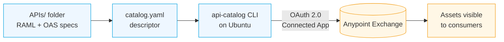

      

# Publishing APIs to Anypoint Exchange with the API Catalog CLI on Ubuntu

Every organization ends up with API specs scattered across laptops, wikis, and git repos long before Anypoint Exchange gets to see them. The **API Catalog CLI** is MuleSoft's answer to that mess: a small command-line tool that reads a descriptor file, packages one or many API specs (RAML or OAS), and publishes them to Exchange in one shot — no browser, no zips, no per-asset click-through.

In this tutorial we'll install the CLI on a fresh **Ubuntu** server, wire it up to an Anypoint **Connected App**, and use it to publish three real APIs shipped with this lab: two RAML specs and one OAS/JSON spec. By the end, we'll have a repeatable command that promotes any folder of specs into Exchange — the exact same command a Jenkins or GitHub Actions job would run.

We'll go slow the first time so the moving parts are clear, then wrap up with a shape you can drop straight into CI.

> [!NOTE]
> The API Catalog CLI is designed for **API discovery in Exchange**, not for API Manager promotion or runtime deployment. Publishing here means the spec (and optional docs/metadata) lands in Exchange as a reusable asset.

## Prerequisites

Before we start, we need:

- An **Ubuntu 22.04 LTS** (or newer) server with `sudo` access — a VM, WSL, or a cloud VM all work
- Outbound HTTPS to `anypoint.mulesoft.com`
- An Anypoint Platform account with permission to create a **Connected App** in the target Business Group
- The three sample APIs from this lab's `APIs/` folder:
  - `gon-flights-api-1.0.3-raml/` — RAML 1.0
  - `orders-system-api-1.0.0-raml/` — RAML 1.0
  - `twilio-system-api-1.0.1-fat-oas/` — OpenAPI 2.0 (JSON, single "fat" file)

<details>
<summary><strong>Lab assets used in this tutorial</strong></summary>

| Asset | Path | Notes |
| --- | --- | --- |
| Flights API (RAML) | [./APIs/gon-flights-api-1.0.3-raml/](./APIs/gon-flights-api-1.0.3-raml/) | Root spec: `gon-flights-api.raml` |
| Orders System API (RAML) | [./APIs/orders-system-api-1.0.0-raml/](./APIs/orders-system-api-1.0.0-raml/) | Root spec: `orders-system-api.raml` |
| Twilio System API (OAS) | [./APIs/twilio-system-api-1.0.1-fat-oas/](./APIs/twilio-system-api-1.0.1-fat-oas/) | Root spec: `api.json` |
| Final descriptor | [./APIs/catalog.yaml](./APIs/catalog.yaml) | The single file that drives the publish |

</details>

## How the pieces fit together

Before typing anything, it helps to picture the flow. The CLI stays local; the only thing it talks to is Exchange:



The **descriptor** (`catalog.yaml`) is where we declare *which* specs to publish and *how* they should appear in Exchange (asset ID, version, tags, categories, contact). The CLI does the rest: validating, zipping, uploading.

## Step 1 — Install Node.js on Ubuntu

The CLI is distributed via npm, so we need a modern Node.js runtime. We'll use NodeSource for a clean install of the current LTS.

```bash
# Refresh apt and install prerequisites
sudo apt update
sudo apt install -y curl ca-certificates gnupg

# Add the NodeSource repository for Node.js 20.x LTS
curl -fsSL https://deb.nodesource.com/setup_20.x | sudo -E bash -

# Install Node.js (includes npm)
sudo apt install -y nodejs

# Verify
node -v
npm -v
```

We should see something like `v20.x.x` for Node and `10.x.x` for npm.

> [!TIP]
> If we're on a corporate proxy, set `HTTPS_PROXY` and `HTTP_PROXY` **before** the `curl` above, and configure npm with `npm config set proxy` / `npm config set https-proxy`.


## Step 2 — Install the API Catalog CLI

With Node in place, one command drops the CLI on the box:

```bash
sudo npm install -g api-catalog-cli@latest
```

Confirm it landed and see the built-in help:

```bash
api-catalog --help
api-catalog --version
```

The three commands we'll use in this tutorial are:

| Command | What it does |
| --- | --- |
| `api-catalog conf <key> <value>` | Persist a configuration key (credentials, host, org) |
| `api-catalog create-descriptor -d <file>` | Scaffold a starter descriptor from a folder |
| `api-catalog publish-asset -d <file>` | Package and upload every project listed in the descriptor |

> [!IMPORTANT]
> The CLI stores its config under `~/.api-catalog/` on the user that ran the install. If we plan to run it as a build user (e.g. `jenkins`), install/configure it **as that user** — global npm binaries are shared, but the config file is per-home.

## Step 3 — Create a Connected App in Anypoint

The CLI authenticates with **OAuth 2.0 client credentials** against a Connected App. We need one with the right scopes before we can publish.

### 3.1 — Create the app

1. In Anypoint Platform, go to **Access Management → Connected Apps → Create app**.
2. Choose **App acts on its own behalf (client credentials)**.
3. Grant the scopes below on the target Business Group:
   - `Exchange Contributor`
   - `Exchange Administrator` *(only if we intend to update existing assets)*
4. Save and copy the generated **Client ID** and **Client Secret** — the secret is shown once.

> 📸 *Screenshot: the Connected App creation form with the two Exchange scopes selected.*

### 3.2 — Note the Organization ID

In **Access Management → Business Groups**, open the target group and copy its **Organization ID** (a GUID). We'll need it in the next step.

> [!WARNING]
> Client secrets are as sensitive as passwords. Never commit them to git, and prefer environment variables or a secrets manager over the on-disk config file in shared environments.

## Step 4 — Configure the CLI

Back on the Ubuntu box, tell the CLI where to talk and who it is:

```bash
api-catalog conf client_id       <YOUR_CLIENT_ID>
api-catalog conf client_secret   <YOUR_CLIENT_SECRET>
api-catalog conf host            anypoint.mulesoft.com
api-catalog conf organization    <YOUR_ORG_ID>
```

```bash
api-catalog conf client_id 67a3a461dc9a4c1a8f40e9671643a326
api-catalog conf client_secret b1d77F60Fa3A428fa5b74014C127155c
api-catalog conf host anypoint.mulesoft.com
api-catalog conf organization 283c9878-0841-42e4-9f9a-7be93db17852
```

For the **EU control plane**, use `eu1.anypoint.mulesoft.com`; for **US GovCloud**, use `gov.anypoint.mulesoft.com`.

Verify the values were written:

```bash
api-catalog conf --list          # ⚠ REVIEW: some CLI versions use `conf get <key>` instead — swap if the flag is not recognized
```

> 📸 *Screenshot: the terminal listing the four configured keys (secret masked).*

## Step 5 — Stage the APIs

Copy the three sample folders and their zipped originals onto the server (SCP, git clone of the lab repo, or `curl` from a raw URL — whichever fits). We should end up with something like:

```
~/api-catalog-lab/
├── gon-flights-api-1.0.3-raml/
│   ├── gon-flights-api.raml
│   ├── datatypes/
│   ├── examples/
│   └── exchange.json
├── orders-system-api-1.0.0-raml/
│   ├── orders-system-api.raml
│   ├── datatypes/
│   ├── examples/
│   └── exchange.json
└── twilio-system-api-1.0.1-fat-oas/
    ├── api.json
    └── exchange.json
```

The `exchange.json` inside each folder is Design Center's own project metadata — worth a short detour before we touch the descriptor, because it's a common source of confusion (and cleanup) when publishing from a folder we didn't author ourselves.

> [!NOTE]
> Notice that Twilio's spec is a **single `api.json`** (a "fat" OAS with no external refs), while the two RAML projects have their own subfolders for `datatypes/` and `examples/`. The CLI handles both shapes.

## Aside — What is `exchange.json`, and do we need it?

Every folder in `APIs/` ships with an `exchange.json` at its root. Design Center writes it automatically for every project it owns, and Exchange bundles it back down whenever we download a spec. Here's the one from `gon-flights-api-1.0.3-raml/`, trimmed for readability:

```json
{
  "main": "gon-flights-api.raml",
  "name": "GON Flights API",
  "classifier": "raml",
  "assetId": "gon-flights-api",
  "version": "1.0.3",
  "apiVersion": "v1",
  "groupId": "fc9e3283-a489-4e88-99aa-cceea4aa5ea1",
  "organizationId": "fc9e3283-a489-4e88-99aa-cceea4aa5ea1",
  "dependencies": [],
  "tags": [],
  "originalFormatVersion": "1.0",
  "descriptorVersion": "1.0.0",
  "metadata": {
    "projectId": "7b165182-982e-4aeb-9d58-7e6a9cc61215",
    "branchId": "master",
    "commitId": "2e04d13c90b9c3d339d3e614b01aa73ae7c9f19f"
  }
}
```

Field by field:

| Field | Purpose |
| --- | --- |
| `main` | Root spec file, relative to the folder |
| `assetId` / `version` / `apiVersion` | Exchange asset coordinates |
| `classifier` | `raml` or `oas` — the spec dialect of the root file |
| `groupId` / `organizationId` | The Business Group that owns the asset |
| `dependencies` | Other Exchange assets this spec `!include`s at build time (e.g. fragment libraries) |
| `metadata` | Design Center's project/branch/commit — used for round-trip editing |

### Is it required to publish?

For the API Catalog CLI, **it's optional**. `catalog.yaml` already declares `main`, `assetId`, `version`, and `apiVersion`, and the CLI packages whichever spec the descriptor points at regardless of what `exchange.json` says. If we deleted every `exchange.json` from the three sample folders and re-ran the publish, the result in Exchange would be the same — with one caveat below.

Two situations where we do want to keep it:

1. **The spec depends on fragments from another Exchange asset.** The `dependencies` array tells the packager which fragments to pull in. Twilio's spec is the only one of the three that has this: it depends on `gon-common-api-fragments 1.0.4`. Delete Twilio's `exchange.json` and its `!include`s of `exchange_modules/…` won't resolve at publish time.
2. **We plan to round-trip with Design Center.** If we'll open the same folder back in Design Center or push it with `anypoint-cli designcenter project push`, `metadata.projectId` is the tether that reconnects the local copy to its cloud project.

For a one-way "publish from CI" flow like this tutorial — no fragments, no round-trip — Flights and Orders don't strictly need theirs; Twilio does.

> [!TIP]
> If `catalog.yaml` and `exchange.json` disagree — say the descriptor sets `version: 1.0.3` and the JSON still says `1.0.0` — the **descriptor wins**. Treat `exchange.json` as read-only from the CLI's point of view and drive changes from `catalog.yaml`.  <!-- ⚠ REVIEW: precedence claim stated from general behavior; confirm against the docs -->

### How to generate one

Three options, easiest first:

1. **Let Design Center create it.** Any project authored in Design Center already has an `exchange.json` in its root. Download the project (**⋯ → Download project**) and the resulting folder is ready to feed the CLI.
2. **Pull it from Exchange with `anypoint-cli`.** For an asset that already exists in Exchange:
   ```bash
   anypoint-cli exchange asset download \
     <groupId>/<assetId>/<version> ./my-api-folder
   ```
   The download contains both the spec **and** its `exchange.json`.
3. **Write it by hand.** For a brand-new spec with no Anypoint history, a minimal file is enough:
   ```json
   {
     "main": "my-api.raml",
     "name": "My API",
     "classifier": "raml",
     "assetId": "my-api",
     "version": "1.0.0",
     "apiVersion": "v1",
     "groupId": "<YOUR_ORG_ID>",
     "organizationId": "<YOUR_ORG_ID>",
     "dependencies": [],
     "tags": [],
     "originalFormatVersion": "1.0"
   }
   ```
   Use `"classifier": "oas"` for an OpenAPI root file instead.

> [!IMPORTANT]
> If we're publishing **from scratch** — no fragments, no Design Center round-trip — the safest choice is to delete `exchange.json` and let `catalog.yaml` be the single source of truth. Fewer files, no drift. For this lab, we'll keep Twilio's (fragment dependency) and delete the other two.

## Step 6 — Generate a starter descriptor

Rather than write the descriptor from scratch, let's have the CLI scan the folder and produce a first draft:

```bash
cd ~/api-catalog-lab
api-catalog create-descriptor -d catalog.yaml
```

Open the result — it should look close to this:

```yaml
# catalog.yaml (auto-generated)
#%Catalog Descriptor 1.0
projects:
  - main: gon-flights-api-1.0.3-raml/gon-flights-api.raml
    assetId: gon-flights-api
    version: 1.0.0
    apiVersion: v1
  - main: orders-system-api-1.0.0-raml/orders-system-api.raml
    assetId: orders-system-api
    version: 1.0.0
    apiVersion: v1
  - main: twilio-system-api-1.0.1-fat-oas/api.json
    assetId: twilio-system-api
    version: 1.0.0
    apiVersion: v1
```

The first line (`#%Catalog Descriptor 1.0`) is mandatory — it tells the CLI which descriptor schema to parse.

📄 Full file: [catalog.yaml (starter)](./APIs/catalog.yaml)

## Step 7 — Enrich the descriptor

The auto-generated file is publishable, but bare. In real life we want tags, categories, contact info, and (optionally) inline documentation so consumers can find and understand each asset. Let's upgrade it:

```yaml
# catalog.yaml (final)
#%Catalog Descriptor 1.0
projects:
  - main: gon-flights-api-1.0.3-raml/gon-flights-api.raml
    assetId: gon-flights-api
    version: 1.0.3
    apiVersion: v1
    tags:
      - flights
      - demo
    categories:
      API Layer: 'Experience API'
      Region: 'EMEA'
    contact:
      name: 'Gonzalo Marcos'
      email: 'gmarcos@salesforce.com'

  - main: orders-system-api-1.0.0-raml/orders-system-api.raml
    assetId: orders-system-api
    version: 1.0.0
    apiVersion: v1
    tags:
      - orders
      - demo
    categories:
      API Layer: 'System API'
      Region: 'EMEA'
    contact:
      name: 'Gonzalo Marcos'
      email: 'gmarcos@salesforce.com'

  - main: twilio-system-api-1.0.1-fat-oas/api.json
    assetId: twilio-system-api
    version: 1.0.1
    apiVersion: v1
    tags:
      - twilio
      - sms
      - demo
    categories:
      API Layer: 'System API'
      Region: 'AMER'
    contact:
      name: 'Gonzalo Marcos'
      email: 'gmarcos@salesforce.com'
```

A few field notes:

| Field | What it drives in Exchange |
| --- | --- |
| `main` | Root spec file the CLI packages (RAML root or the OAS entry point) |
| `assetId` | The immutable identifier of the asset — think slug |
| `version` | The **asset** version in Exchange (semver); bump on any spec change |
| `apiVersion` | The **API** version consumers see (`v1`, `v2`, …) — bumped only on breaking API changes |
| `tags` | Free-form discovery keywords |
| `categories` | Governed key/value pairs — the keys (e.g. `API Layer`, `Region`) must already exist in the org's Exchange taxonomy |
| `contact` | Owner shown on the asset page |

> [!IMPORTANT]
> The `categories` keys must match the **exact** category names configured in **Exchange → Customize → Categories**. A typo silently drops the value on publish — the asset appears, but uncategorized.

## Step 8 — Publish

With credentials configured and the descriptor ready:

```bash
api-catalog publish-asset -d catalog.yaml
```

The CLI walks each `projects[]` entry, validates the spec, zips it (pulling in `datatypes/`, `examples/`, and `exchange.json` alongside `main`), and uploads it as an Exchange asset. Expect output similar to:

```diff
+ [gon-flights-api]      packaged (RAML)      → uploaded  1.0.3
+ [orders-system-api]    packaged (RAML)      → uploaded  1.0.0
+ [twilio-system-api]    packaged (OAS)       → uploaded  1.0.1
Done. 3/3 assets published.
```

> 📸 *Screenshot: terminal output showing the three assets published.*

## Step 9 — Verify in Anypoint Exchange

Open **Exchange** in the browser, filter by the tag `demo`, and we should see all three assets on the landing page. Clicking each one shows the spec rendered, the categories in the right rail, and the contact block at the bottom.

> 📸 *Screenshot: Exchange showing the three published assets side by side.*

Try a small change — bump `version: 1.0.3` to `1.0.4` on the flights entry and re-run `publish-asset`. Exchange will keep both versions, and consumers can switch between them from the version dropdown.

## Wrap it in one repeatable command

Once the descriptor is in git next to the specs, the entire promotion collapses to two lines a CI job can run unchanged:

```bash
api-catalog conf client_id     "$ANYPOINT_CLIENT_ID"
api-catalog conf client_secret "$ANYPOINT_CLIENT_SECRET"
api-catalog conf host          anypoint.mulesoft.com
api-catalog conf organization  "$ANYPOINT_ORG_ID"

api-catalog publish-asset -d catalog.yaml
```

Feed the four values as **masked build secrets**, and every push to `main` refreshes Exchange automatically.

## Troubleshooting

| Symptom | Likely Cause | Fix |
| --- | --- | --- |
| `401 Unauthorized` on publish | Wrong Client ID/Secret, or app not scoped to the target Business Group | Recheck `api-catalog conf --list`; regenerate the secret; verify Connected App scopes include *Exchange Contributor* |
| `403 Forbidden` on a specific asset | Asset already exists under a **different** Business Group with the same `assetId` | Change `assetId`, or move to the owning BG |
| `Category "X" not found` | The `categories:` key isn't defined in Exchange | Add it under **Exchange → Customize → Categories**, then re-run |
| RAML validation error on `!include` | The included file lives outside the folder the CLI zips (only siblings of `main` are packaged) | Move the fragment into the project folder, or publish the fragment as its own Exchange asset and reference it via `exchange_modules` |
| `409 Conflict — version already exists` | Trying to re-publish the same `version` | Bump `version:` in `catalog.yaml`; Exchange versions are immutable |
| CLI hangs behind a proxy | `npm` was proxied but the CLI's outbound HTTPS is not | Export `HTTPS_PROXY` in the shell that runs `publish-asset` |

## Summary

We installed the API Catalog CLI on a fresh Ubuntu box, connected it to Anypoint through a Connected App, and used a single `catalog.yaml` descriptor to publish three real specs — two RAML projects and one "fat" OAS — into Exchange. The same command now belongs in CI, where every merged PR keeps Exchange in lockstep with the code.

> ➡️ **Next up:** In the follow-up post we'll wire this exact command into a **Jenkins** pipeline running in Docker, promote the descriptor to a repo of its own, and gate publication behind a `munit`-driven spec-quality check.  <!-- ⚠ REVIEW: teaser assumes a next post in the series — trim if this is a standalone post -->

## References

- [API Catalog CLI — official documentation](https://docs.mulesoft.com/exchange/api-catalog-cli "MuleSoft docs: API Catalog CLI")
- [Anypoint Connected Apps — client credentials flow](https://docs.mulesoft.com/access-management/connected-apps-overview "MuleSoft docs: Connected Apps")
- [Anypoint Exchange — assets and versioning](https://docs.mulesoft.com/exchange/ "MuleSoft docs: Exchange")
- [NodeSource — installing Node.js on Ubuntu](https://github.com/nodesource/distributions "NodeSource Node.js binary distributions")
- [RAML 1.0 specification](https://raml.org/ "RAML — RESTful API Modeling Language")
- [OpenAPI Specification](https://spec.openapis.org/ "OpenAPI Specification home")
